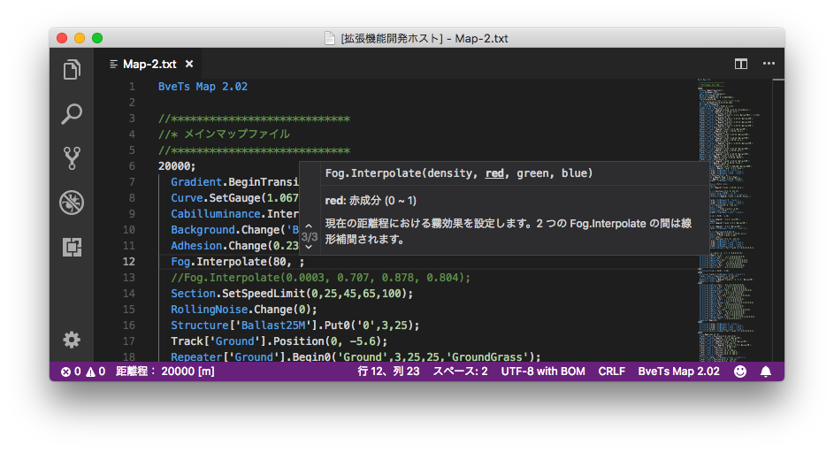
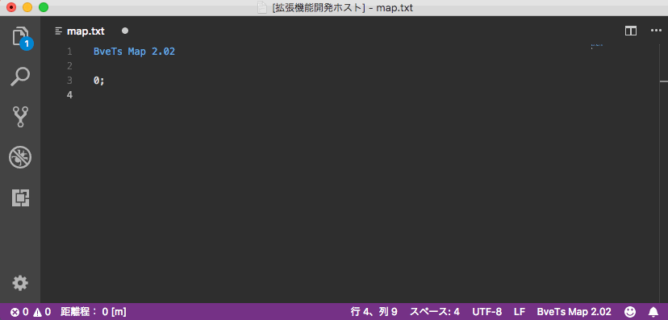

# bve5-language-support for VsCode

VsCodeでBveTrainsim5.7構文をサポートするためのエクステンションです。

## Features

以下の機能をサポートしています。
- シンタックスハイライト
- コード補完
- 構文のヒント表示(シグネチャヘルプ)
- スニペット挿入
- マップファイルの距離程表示

現在はBveTs5.7のマップファイルのみに対応しています。その他の構文は今後対応予定です。

## Requirements

- VsCode 1.24以上

## Release Notes

詳細は[CHANGELOG](CHANGELOD.md)を見てください。

### 0.1.0 - 2018/07/03

Initial release.

-----------------------------------------------------------------------------------------------------------

## License

The MIT License(MIT)

Copyright(c) 2018 aoisupersix

[License.md](License.md)
