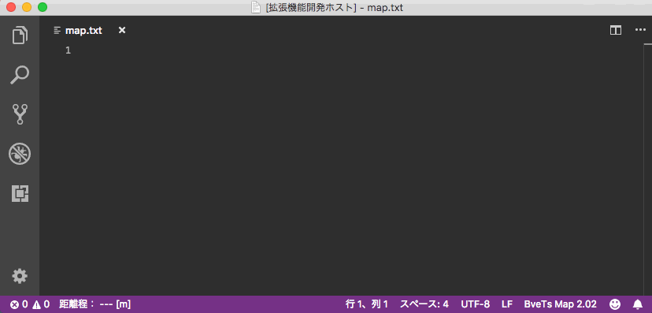
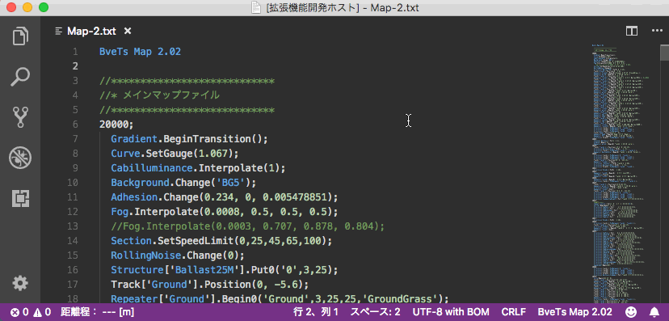
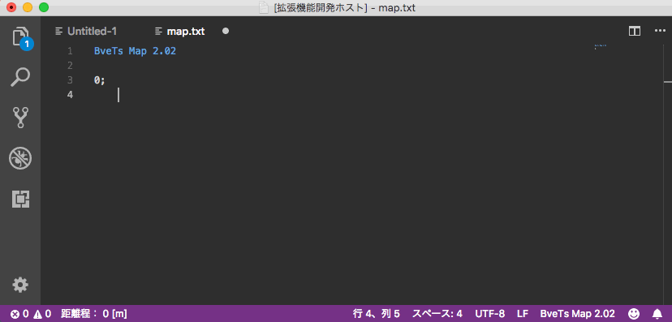
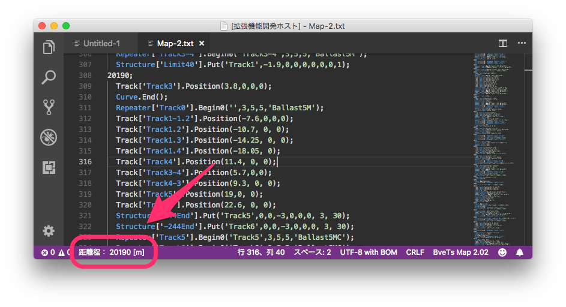

# Bve5 Language Support for VSCode

VSCodeでBveTrainsim5.7構文をサポートするための拡張です。

## Features

本拡張では、以下の機能をサポートしています。
- シンタックスハイライト
- コード補完
- ホバー表示
- 構文のヒント表示(シグネチャヘルプ)
- スニペット挿入
- マップファイルの距離程表示

なお、ファイルの種別によって対応する機能が異なります。
現在対応しているファイル種別と機能を以下の通りです。

|ファイル種別 |vscode上での文法名|シンタックスハイライト|コード補完|ホバー|シグネチャヘルプ|スニペット|
|:-:|:-:|:-:|:-:|:-:|:-:|:-:|
|[マップファイル](http://bvets.net/jp/edit/formats/route/map.html)|BveTs Map 2.02|○|○|○|○|△|
|[車両ファイル](http://bvets.net/jp/edit/formats/vehicle/vehicle.html)|BveTs Vehicle 1.00|○|-|○|-|○|

凡例：`○`...全構文に対応, `△`...一部構文に対応, `-`...非対応

## Requirements

- VSCode 1.24以上

## How to use this extension?

1. [Visual Studio Code](https://code.visualstudio.com)をインストールして起動し、 `Ctrl+Shift+X`、もしくは`Cmd+Shift+X`を入力して拡張機能パネルを開いてください。 
2. [Marketplace](https://marketplace.visualstudio.com/items?itemName=aoisupersix.bve5-language-support)から`Bve5 Language Support`を検索してインストールします。
3. エディタ右下の`言語モードの選択`をクリックして`BveTs Map 2.02`or`BveTs Vehicle 1.00`を選択することで拡張を有効化することが出来ます。

## Code completion

要素名(`Curve`,`Gradient`など)を入力した直後、\``.(DOT)`\`を入力することで、マップ要素に対応する関数名の候補を表示します。

## Hover

構文にカーソルを重ねた際に、その構文のヒントを表示します。

## Signature Help

構文を入力する際に、引数のヘルプを表示します。

このヘルプは\``(`\`の入力にトリガーされて表示されるので、スニペット挿入等で\``(`\`の入力を省略した際は表示されません。これに関しては後々改良するかもしれません。

## Snippets

スニペット挿入とは繰り返し入力する記述を自動で入力してくれる機能です。
スニペット挿入に対応している構文を入力するとスニペットの候補が出てくるので、`TAB`を押すことで構文を自動で入力、引数の位置へとカーソルを移動してくれます。

なお、マップファイルのスニペット挿入は個人的によく使う、もしくは他の構文と被らないと考えた以下の構文にのみ対応しています。
- Curve.BeginTransition
- Curve.Begin
- Gradient.BeginTransition
- Gradient.Begin
- Track[].X.Interpolate
- Track[].Y.Interpolate
- Track[].Position
- Structure[].Put
- Structure[].Put0
- Structure[].PutBetween
- Repeater[].Begin
- Repeater[].Begin0
- Section.Begin
- Signal[].Put
- Beacon.Put
- CabIlluminance.Interpolate
- Sound[].Play
- Sound3D[].Play
- RollingNoise.Change
- FlangeNoise.Change
- JointNoise.Play

もしスニペットが鬱陶しいと感じたら、設定からスニペットを非表示にしてください。

## Distance Checker

マップファイル文法において、VSCodeのステータスバーにカーソル位置の距離程を表示します。

変数や数式が含まれる距離程には未対応ですが、数式に関しては今後サポートするかもしれません。

## Support

バグの報告や質問、要望等はIssue、もしくは[こちら](http://aoisupersix.tokyo)へどうぞ。

## Release Notes

詳細は[CHANGELOG](CHANGELOG.md)を見てください。

### 0.2.1 - 2018/07/01
- ドキュメント等の軽微な修正

### 0.2.0 - 2018/07/01
- ホバー表示の実装
- 一部抜けていた構文を追加

### 0.1.0 - 2018/06/30
- Initial release.

-----------------------------------------------------------------------------------------------------------

## License

The MIT License(MIT)

Copyright(c) 2018 aoisupersix

[License.md](LICENSE.md)
